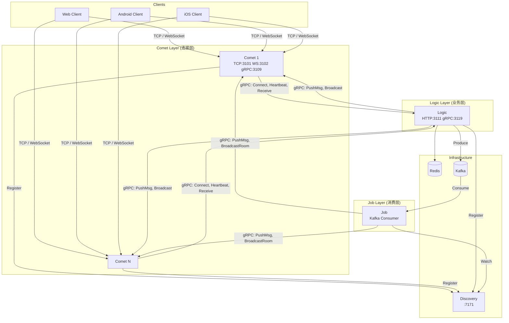
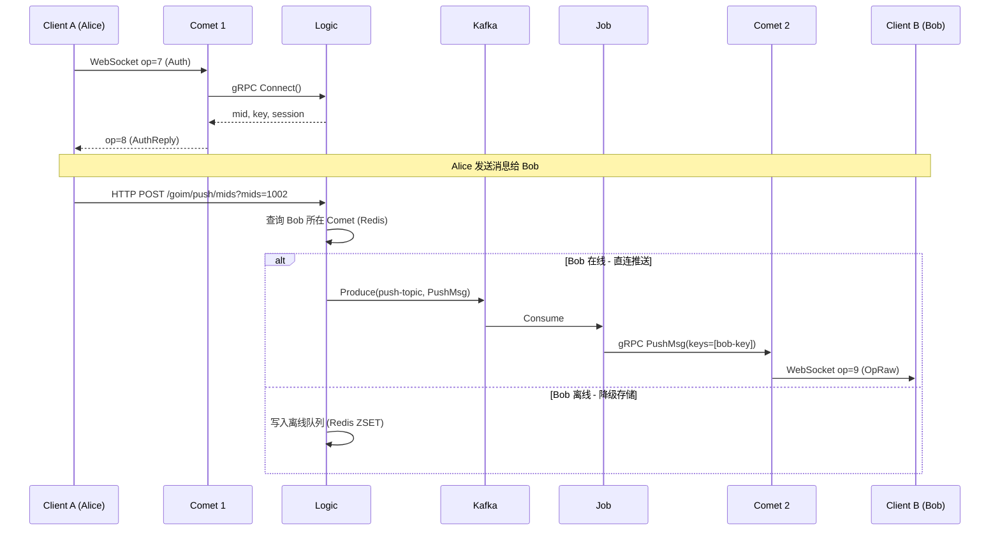
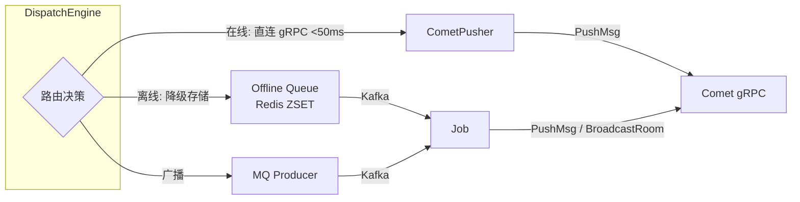

# goim v3.0

[](https://golang.org/)
[](https://github.com/Terry-Mao/goim/actions)
[](https://pkg.go.dev/github.com/Terry-Mao/goim)
[](https://goreportcard.com/report/github.com/Terry-Mao/goim)

goim 是一个高性能的分布式 IM（即时通讯）服务端，基于 Go 语言实现，支持单播、多播、广播消息推送，支持 TCP/WebSocket 双协议接入。

[English](./README_en.md) | [中文详细文档](./README_cn.md)

## 架构

### 系统拓扑



### 消息推送流程



### 双通道推送架构 (v3)



## 特性

- **双通道推送**: 在线用户直连 gRPC 推送（<50ms），离线消息 Kafka 降级 + Redis 离线队列
- **消息 ACK + 重试**: 指数退避重试，最多 3 次，消息状态全链路追踪
- **离线消息同步**: Redis ZSET 存储，用户上线自动回放
- **多设备 Session**: 同设备互踢，跨设备共存，心跳自动续期
- **Message Router**: v3 架构，Producer -> Router -> MQ -> Worker -> Gateway
- **双协议接入**: TCP / WebSocket，二进制协议，16 字节头
- **Prometheus 监控**: 连接数、消息吞吐、延迟指标暴露
- **令牌桶限流**: 每连接独立限流，防止恶意刷消息
- **Snowflake ID**: 分布式唯一消息 ID 生成
- **区域感知负载均衡**: IP 地理位置 -> 省份 -> 区域，同区域 Comet 优先

## 快速开始

### Docker Compose 一键部署

```bash
docker compose up -d
```

服务启动后（约 30 秒），访问:
- Logic HTTP API: `http://localhost:3111/goim/online/total`
- WebSocket 聊天 Demo: `http://localhost:8080`
- Comet WebSocket: `ws://localhost:3102/sub`
- Discovery: `http://localhost:7171/discovery/fetch?env=dev&appid=goim.comet`

### 手动构建

```bash
make build

# 启动服务
nohup target/logic -conf=target/logic.toml -region=sh -zone=sh001 -deploy.env=dev -weight=10 &
nohup target/comet -conf=target/comet.toml -region=sh -zone=sh001 -deploy.env=dev -weight=10 -addrs=127.0.0.1 &
nohup target/job -conf=target/job.toml -region=sh -zone=sh001 -deploy.env=dev &
```

### 环境变量

| 变量 | 说明 | 默认值 |
|------|------|--------|
| `REGION` | 区域 | sh |
| `ZONE` | 机房 | sh001 |
| `DEPLOY_ENV` | 部署环境 | dev |

## 配置

配置文件模板在 `cmd/*/` 目录下:

| 服务 | 配置文件 | 关键配置项 |
|------|----------|-----------|
| comet | `comet-example.toml` | TCP/WS 端口、协议参数、桶大小 |
| logic | `logic-example.toml` | Redis/Kafka 地址、心跳间隔、重试策略 |
| job | `job-example.toml` | Kafka topic、消费组 |

## HTTP API

| 方法 | 路径 | 说明 |
|------|------|------|
| POST | `/goim/push/keys` | 按连接 key 推送 |
| POST | `/goim/push/mids` | 按用户 ID 推送 |
| POST | `/goim/push/room` | 房间广播 |
| POST | `/goim/push/all` | 全局广播 |
| POST | `/goim/push/offline` | 离线消息存储 |
| GET | `/goim/sync` | 同步离线消息 |
| GET | `/goim/online/top` | 热门房间 |
| GET | `/goim/online/room` | 房间在线数 |
| GET | `/goim/online/total` | 总连接数 |
| GET | `/goim/nodes/weighted` | 节点列表（加权） |
| GET | `/metrics` | Prometheus 指标 |

## WebSocket Demo

浏览器聊天演示，支持两个用户实时互发消息:

```bash
# Docker Compose 已包含
open http://localhost:8080

# 或单独运行
go run examples/javascript/main.go
open http://localhost:1999
```

## 压测

```bash
# 连接压测
go run benchmarks/conn_bench.go -host=localhost:3101 -count=1000

# 推送压测
go run benchmarks/push_bench.go -logic-host=localhost:3111 -comet-host=localhost:3102

# 一键压测 + 报告
bash benchmarks/run.sh
```

### 历史数据

| 指标 | 数值 |
|------|------|
| 在线连接数 | 1,000,000 |
| 测试时长 | 15 分钟 |
| 房间广播频率 | 40/s |
| 消息接收吞吐 | 35,900,000/s |

[详细数据 (中文)](./docs/benchmark_cn.md) | [Detailed (English)](./docs/benchmark_en.md)

## 目录结构

```
goim/
├── api/                    # Protobuf 定义和生成代码
│   ├── comet/              # Comet gRPC 服务定义
│   ├── logic/              # Logic gRPC 服务定义
│   └── protocol/           # 二进制协议 + 消息格式
├── benchmarks/             # 压测工具
├── cmd/                    # 服务入口
│   ├── comet/              # Comet (TCP/WS 网关)
│   ├── logic/              # Logic (业务逻辑)
│   └── job/                # Job (Kafka 消费者)
├── deploy/                 # Docker 部署配置
│   ├── configs/            # Docker 环境配置文件
│   ├── discovery/          # 简化版 Discovery 服务
│   └── nginx.conf          # Nginx 反向代理配置
├── docs/                   # 文档和架构图
├── examples/               # 示例代码
│   ├── chat-demo/          # WebSocket 聊天演示
│   ├── javascript/         # JS WebSocket 客户端
│   └── e2e_test_client/    # TCP 测试客户端
├── integration_test/       # 集成测试
├── internal/               # 核心业务逻辑
│   ├── comet/              # 连接层 (TCP/WS/gRPC)
│   ├── job/                # 消费层 (Kafka -> Comet)
│   ├── logic/              # 业务层 (HTTP/gRPC API)
│   ├── mq/                 # 消息队列抽象层
│   ├── router/             # 消息路由引擎
│   └── worker/             # DeliveryWorker (v3)
├── pkg/                    # 公共工具包
├── scripts/                # 运维脚本
├── third_party/            # 第三方依赖 (Discovery)
├── docker-compose.yml      # 一键部署
├── Dockerfile              # 多阶段构建
└── Makefile                # 构建脚本
```

## SDK

- Android: [goim-sdk](https://github.com/roamdy/goim-sdk)
- iOS: [goim-oc-sdk](https://github.com/roamdy/goim-oc-sdk)

## License

goim is distributed under the terms of the MIT License.
