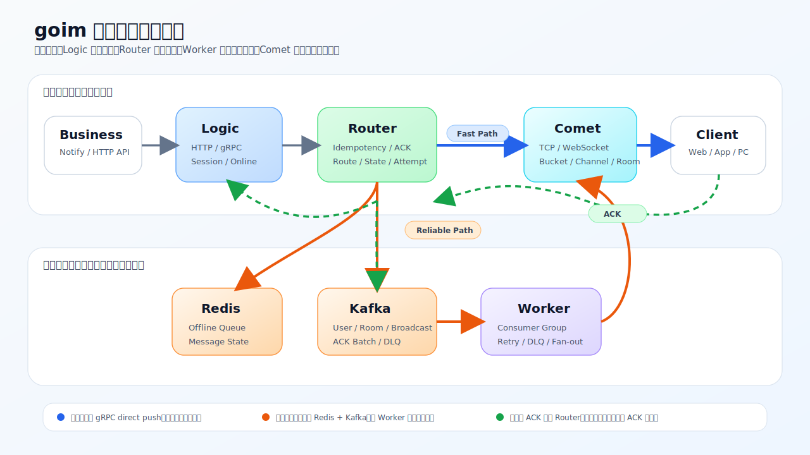
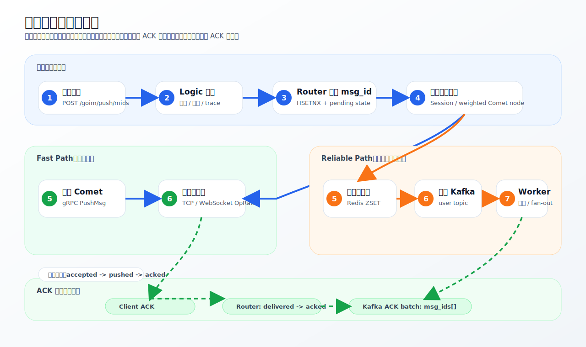

# goim

[](https://go.dev/)
[](https://kafka.apache.org/)
[](https://redis.io/)
[](./LICENSE)

goim 是基于 [Terry-Mao/goim](https://github.com/Terry-Mao/goim) 演进的实时消息投递系统。当前项目的核心不再只是原版 Comet / Logic / Job 管道，而是拆出了清晰的 **Comet、Logic、Router、Worker 四层架构**，把长连接接入、业务入口、路由决策和投递执行分开治理。

这套改进的目标是让 goim 从“能推消息”升级为“可追踪、可补偿、可恢复、可运营”的消息中台：在线直推走低延迟路径，离线或失败进入可靠路径；消息具备 msg_id、幂等、ACK、轻量状态闭环、attempt、trace、DLQ 和业务 SLA；上层业务可以通过 HTTP API 接入，而不需要理解长连接和 Kafka 投递细节。

## 核心架构



### 四层职责

| 层 | 代码位置 | 当前运行形态 | 核心职责 |
| --- | --- | --- | --- |
| Comet | `internal/comet`, `cmd/comet` | 独立进程 `comet` | 长连接接入层。维护 TCP / WebSocket 连接、Bucket 分片、Channel、Room、优先级队列，并通过 gRPC 接收投递指令。 |
| Logic | `internal/logic`, `cmd/logic` | 独立进程 `logic` | 薄业务入口层。暴露 HTTP/gRPC API，管理 Session、在线状态、节点发现、离线同步入口，并把推送请求交给 Router。 |
| Router | `internal/router` | 当前嵌入 Logic 进程，边界已独立 | 消息路由决策层。负责 msg_id、幂等抢占、在线判断、直推/fallback 决策、离线队列、ACK、投递结果，并预留状态 timeline 与 attempt recorder hooks。 |
| Worker | `internal/worker`, `cmd/job` | 独立进程 `job`，语义上是 Delivery Worker | 投递执行层。消费 Kafka Consumer Group，处理单播/房间/广播消息，管理 Comet 连接池、重试、DLQ 和房间聚合。 |

Redis、Kafka、Discovery、MySQL 是基础设施，不是核心业务层级。Notify Server 和 Dashboard 是建立在四层消息中台之上的业务验证与运营系统。

## 相比原 goim 的改进

| 原 goim 管道 | 当前项目改进 |
| --- | --- |
| Logic 同时承担 API、Session、推送路由 | Logic 变薄，Router 承担消息路由、可靠性和投递状态 |
| Kafka 更像传输管道 | Kafka 成为可靠投递通道，承载 user / room / broadcast / ACK / DLQ 事件 |
| Job 消费 Kafka 后推 Comet | Worker 具备 Consumer Group、CometClientPool、room aggregation、retry counter、DLQ |
| Comet 负责长连接和部分业务操作 | Comet 聚焦接入、连接、房间、队列和字节下发 |
| 消息链路可见性弱 | msg_id、delivery_result、ACK、trace_id 已进入主链路，attempt/state recorder 具备扩展点 |
| 业务示例较薄 | Notify Server 提供订单通知、outbox、SLA、DLQ 恢复、审批和 Dashboard |

## 消息投递链路

### 单用户推送



### Router 的双通道策略

- `RouteByUser`：单用户/多设备推送。在线时优先直连 Comet；全部失败或离线时进入 Redis 离线队列 + Kafka fallback；部分失败时成功设备标记 delivered，失败设备补走可靠通道。
- `RouteByRoom`：房间消息优先进入 Kafka room topic，由 Worker 聚合后广播；Kafka 写入失败时可直接 gRPC 广播兜底。
- `RouteBroadcast`：全服广播优先进入 Kafka broadcast topic，由 Worker 分发到所有 Comet；支持 speed 控制。
- `ACKHandler`：处理客户端 ACK，更新 Redis 消息状态，移除离线队列，发布 ACK 事件，并记录设备级 ACK。

## 核心能力

### 可靠投递

- 双通道投递：在线直推作为 fast path，Kafka + Redis 离线队列作为 reliable path。
- 原子幂等：Router 使用 Redis `HSETNX` 抢占 `msg_id`，避免重复投递。
- 状态追踪：主链路收敛为 `accepted -> pushed -> acked / timeout / failed`，`routed`、`direct_failed`、`fallback_queued`、`offline_stored` 等细粒度状态作为 trace timeline 扩展点。
- 投递审计：`DeliveryResult` 返回 `grpc_direct`、`kafka_fallback`、`offline_stored`、`failed` 等路径。
- 设备级 ACK：ACK 可携带 `device_id`、`session_id`，支持多端通知统计。
- ACK 事件合并：同一用户在短时间窗口内的多条 ACK 会合并为一条 Kafka 事件，事件同时保留 `msg_id` 和 `msg_ids`，兼容单条消费与批量同步。
- 离线同步：Redis ZSET 保存离线消息，用户上线后按 cursor / seq 拉取。

### 高并发接入

- Comet 使用 Bucket 分片管理连接，Channel 维护单连接写队列和订阅的 op。
- Channel 内置 high / normal 优先级队列，控制信令和业务消息分级下发。
- Worker 使用 CometClientPool 做到面向 Comet 的并发 fan-out。
- RoomAggregator 对房间消息做批量聚合，减少大房间广播的 RPC 压力。
- Broadcast 支持按 Comet 数量分摊 speed，避免瞬时全服广播打满网络。

### 可观测与治理

- Logic 和 Notify Server 暴露 Prometheus `/metrics`。
- `trace_id` 可从 Notify 透传到 Logic、Router、Kafka、Worker 和 ACK 事件。
- ACK topic 默认采用 50ms 短窗口、最多 100 条 msg_id 的合并发送，降低高并发 ACK 对 Kafka 的写入放大；Notify ACK bridge 可按 `msg_ids` 展开同步。
- Router 侧返回 push path 和 latency，并提供 attempt / state timeline recorder 扩展点。
- Worker 支持 retry counter 和 DLQ producer，消息超过重试上限进入死信队列。
- Notify Server 提供 notification trace、order timeline、business SLA、DLQ audit 和 recovery approval。

## 业务验证层：Notify Server

Notify Server 不是四层核心架构的一部分，而是本项目用来证明消息中台价值的业务应用。它模拟电商订单通知场景，并把推送结果沉淀成可运营数据。

它提供：

- 订单创建、订单状态变更、物流更新、秒杀/营销活动通知。
- MySQL 持久化 orders、notifications、notification_outbox、attempts、ACK、DLQ、recovery audit、scenario runs、idempotency keys。
- Outbox Pattern：业务写入与通知投递在事务边界内落库，后台 worker 异步推送 Logic。
- Policy 配置：优先级、TTL、ACK 策略、最大重试、DLQ 策略、通知模板；缺省情况下使用内置策略，可通过 `configs/notify_policy.yaml` 覆盖。
- Campaign：targeted users、audience import、batch retry、pause/resume/cancel。
- 运营 API：通知 trace、订单 timeline、SLA、DLQ replay/resolve、批量恢复审批和节流执行。

Dashboard 位于 `web/dashboard`，用于查看订单、通知、SLA、DLQ、场景压测、在线会话和实时消息流。

## 快速开始

### 1. 启动核心链路

`docker-compose.yml` 会启动 Redis、Kafka、Discovery、Logic、Comet、Job(Worker) 和基础聊天 demo：

```bash
docker compose up -d --build
```

检查核心服务：

| 服务 | 地址 |
| --- | --- |
| Logic 在线统计 | http://localhost:3111/goim/online/total |
| Logic Metrics | http://localhost:3111/metrics |
| Comet WebSocket | ws://localhost:3102/sub |
| Chat Demo | http://localhost:8080 |
| Discovery | http://localhost:7171 |

### 2. 启动 Notify Server 依赖

Notify Server 当前使用 MySQL：

```bash
docker run --name goim-notify-mysql \
  -e MYSQL_ROOT_PASSWORD=root \
  -e MYSQL_DATABASE=goim_notify \
  -e MYSQL_USER=goim \
  -e MYSQL_PASSWORD=goim \
  -p 3306:3306 \
  -d mysql:8.4
```

已有 MySQL 时只需创建数据库：

```sql
CREATE DATABASE goim_notify CHARACTER SET utf8mb4 COLLATE utf8mb4_unicode_ci;
```

配置文件：`cmd/notify-server/notify-example.toml`

```toml
listen = ":3121"
logic_addr = "localhost:3111"

[storage]
driver = "mysql"
dsn = "goim:goim@tcp(127.0.0.1:3306)/goim_notify?charset=utf8mb4&parseTime=true&loc=Local"
```

### 3. 启动 Notify Server

Linux / macOS:

```bash
go build -o target/notify-server ./cmd/notify-server/main.go
./target/notify-server -conf=cmd/notify-server/notify-example.toml
```

Windows PowerShell:

```powershell
go build -o target/notify-server.exe ./cmd/notify-server/main.go
.\target\notify-server.exe -conf=cmd/notify-server/notify-example.toml
```

检查：

```bash
curl http://localhost:3121/api/platform/stats
curl http://localhost:3121/metrics
```

### 4. 启动 Dashboard

```bash
cd web/dashboard
npm install
npm run dev
```

访问 http://localhost:5173。

Vite 代理配置：

- `/api` -> `http://127.0.0.1:3121`
- `/goim` -> `http://127.0.0.1:3111`
- `/sub` -> `ws://127.0.0.1:3102`

后端未启动时，可使用 mock 模式：

```bash
VITE_USE_MOCK=true npm run dev
```

## 常用 API

### Logic Push API

| 方法 | 路径 | 说明 |
| --- | --- | --- |
| POST | `/goim/push/keys?operation=&keys=` | 按连接 key 推送 |
| POST | `/goim/push/mids?operation=&mids=` | 按用户 mid 推送，返回 `delivery_results` |
| POST | `/goim/push/room?operation=&type=&room=` | 房间广播 |
| POST | `/goim/push/all?operation=&speed=` | 全服广播 |
| POST | `/goim/push/offline?mid=&seq=&op=` | 写入离线/可靠路径 |
| GET | `/goim/sync?mid=&last_seq=&limit=` | 拉取离线消息 |
| GET | `/goim/online/total` | 全局在线统计 |
| GET | `/goim/online/room` | 房间在线统计 |
| GET | `/goim/online/top` | 热门房间 |
| GET | `/goim/nodes/weighted` | 加权 Comet 节点 |
| GET | `/goim/nodes/instances` | Comet 实例列表 |
| GET | `/metrics` | Prometheus 指标 |

### Notify Server API

| 方法 | 路径 | 说明 |
| --- | --- | --- |
| POST | `/api/order/create` | 创建订单并写入通知 outbox |
| POST | `/api/order/status-change` | 订单状态流转并写入通知 outbox |
| POST | `/api/logistics/update` | 物流通知 |
| POST | `/api/flash-sale/notify` | 秒杀/活动通知 |
| POST | `/api/ack` | 业务通知 ACK |
| GET | `/api/orders/:order_id` | 订单详情 |
| GET | `/api/orders/:order_id/timeline` | 订单时间线 |
| GET | `/api/user/:uid/notifications` | 用户通知 |
| GET | `/api/notifications/:notify_id/trace` | 通知全链路 trace |
| GET | `/api/platform/stats` | 平台统计 |
| GET | `/api/platform/sla?window=24h` | 业务 SLA |
| GET | `/api/dlq` | DLQ 列表 |
| POST | `/api/dlq/:id/replay` | 重放单条 DLQ |
| POST | `/api/dlq/:id/resolve` | 关闭单条 DLQ |
| POST | `/api/dlq/bulk/replay` | 批量重放 DLQ |
| POST | `/api/dlq/bulk/resolve` | 批量关闭 DLQ |
| GET | `/api/recovery/audits` | 恢复审计 |
| POST | `/api/recovery/replay-requests` | 创建批量恢复审批 |
| POST | `/api/scenarios` | 启动可追踪场景 |
| GET | `/api/scenarios/:id/report` | 场景报告 |

写操作支持 `Idempotency-Key` 请求头或 `idempotency_key` JSON 字段。

## 示例

创建订单：

```bash
curl -X POST http://localhost:3121/api/order/create \
  -H 'Content-Type: application/json' \
  -H 'Idempotency-Key: order-demo-001' \
  -d '{
    "user_id": "10001",
    "total": 199.00,
    "items": [
      {"product_name": "iPhone Case", "quantity": 1, "price": 199.00}
    ]
  }'
```

订单状态流转：

```bash
curl -X POST http://localhost:3121/api/order/status-change \
  -H 'Content-Type: application/json' \
  -H 'Idempotency-Key: order-demo-001-paid' \
  -d '{
    "order_id": "<上一步返回的 order.order_id>",
    "new_status": "paid",
    "extra": {"reason": "payment received"}
  }'
```

按用户推送：

```bash
curl -X POST 'http://localhost:3111/goim/push/mids?operation=1000&mids=10001' \
  -H 'Content-Type: application/json' \
  -d '{"text":"hello goim","trace_id":"trace-demo-001"}'
```

启动场景：

```bash
curl -X POST http://localhost:3121/api/scenarios \
  -H 'Content-Type: application/json' \
  -d '{"mode":"lifecycle","qps":100,"users":1000}'
```

## 本地开发

```bash
# 构建 comet / logic / job(worker) / notify-server
make build

# 仅构建 Notify Server
make build-notify

# Go 测试
go test ./...

# Notify Server 测试
go test ./internal/notify/...

# MySQL store 集成测试
GOIM_NOTIFY_MYSQL_DSN='goim:goim@tcp(127.0.0.1:3306)/goim_notify?charset=utf8mb4&parseTime=true&loc=Local' \
  go test ./internal/notify/store -run MySQL -v
```

> `Makefile` 使用 Unix 风格命令。Windows 环境如果没有对应 shell，建议直接使用 `go build` / `go test`。

## 项目结构

```text
goim/
├── api/                         # comet / logic protobuf 与客户端协议
├── cmd/
│   ├── comet/                   # Comet 进程入口
│   ├── logic/                   # Logic 进程入口，内部组装 Router
│   ├── job/                     # Worker 进程入口，历史命名保留为 job
│   └── notify-server/           # 业务通知平台入口
├── internal/
│   ├── comet/                   # 长连接接入、Bucket、Channel、Room、PriorityQueue
│   ├── logic/                   # API、Session、节点发现、离线同步入口
│   ├── router/                  # Message Router：路由、幂等、ACK、限流、delivery result、recorder hooks
│   ├── worker/                  # Delivery Worker：Kafka 消费、Comet fan-out、DLQ、房间聚合
│   ├── mq/                      # MQ 抽象、消息 envelope、ACK/DLQ 类型、Kafka ACK batcher
│   ├── notify/                  # 订单通知业务平台
│   ├── grpcx/                   # gRPC 拦截器
│   └── tracectx/                # trace / correlation 上下文
├── pkg/                         # 公共基础库
├── web/dashboard/               # React 运营工作台
├── examples/                    # WebSocket / JS / E2E 示例
├── deploy/                      # Docker 与部署配置
├── configs/                     # 可选本地策略配置，缺省可为空
├── docs/                        # 架构、协议、压测与改进文档
└── docker-compose.yml
```

## 配置入口

| 组件 | 配置文件 |
| --- | --- |
| Comet | `cmd/comet/comet-example.toml` |
| Logic | `cmd/logic/logic-example.toml` |
| Worker(Job) | `cmd/job/job-example.toml` |
| Notify Server | `cmd/notify-server/notify-example.toml` |
| Docker Comet | `deploy/configs/comet-docker.toml` |
| Docker Logic | `deploy/configs/logic-docker.toml` |
| Docker Worker | `deploy/configs/job-docker.toml` |
| Notify Policy | `configs/notify_policy.yaml`（可选，缺省使用内置策略） |

## 当前边界

- Router 的代码边界已经独立在 `internal/router`，当前运行时嵌入 Logic 进程；后续可以继续演进为独立 Router 服务。
- Worker 的代码边界已经独立在 `internal/worker`，当前进程入口沿用 `cmd/job`，但语义上是 Delivery Worker。
- Notify Server 是业务验证层，不是核心四层之一；它用于展示订单通知、可靠 outbox、SLA、DLQ 和恢复治理。
- `docker-compose.yml` 当前启动核心链路和基础 demo；Notify Server、MySQL 和 Dashboard 需要按文档单独启动。
- 房间级秒杀广播当前追踪 room-level 投递，不等同于每用户独立 ACK；需要 per-user ACK 时使用 targeted campaign 或 audience snapshot。
- ACK 合并窗口和批量上限当前是代码默认值（50ms / 100 条），还没有做成外部配置；如果需要按业务动态调节，可以继续下沉到 Logic/Worker 配置。
- `configs/notify_policy.yaml` 不是必需文件；缺失时 Notify Server 会回退到内置默认策略。

## 设计文档

- [推送链路说明](./docs/push.md)
- [协议说明](./docs/proto.md)
- [压测报告](./docs/benchmark_cn.md)
- [改进路线记录](./docs/improvement-roadmap.md)
- [完整推送链路 D2](./docs/push_chain_full.d2)
- [登录连接流程](./docs/login-connection-flow.mmd)

## License

[MIT](./LICENSE)
