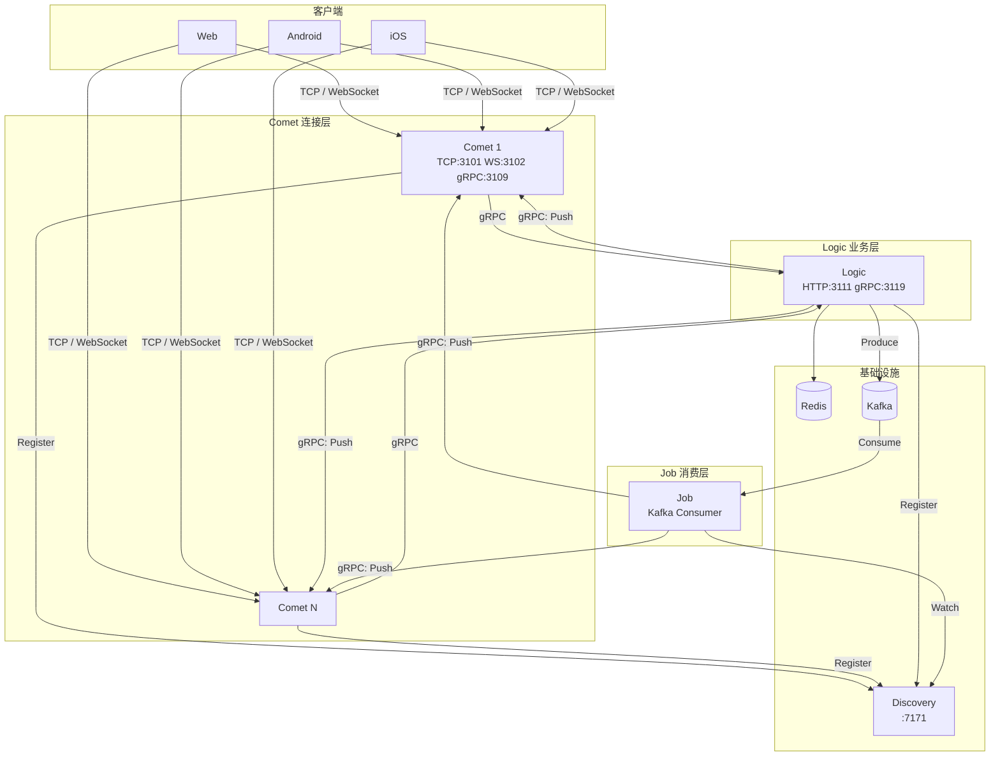
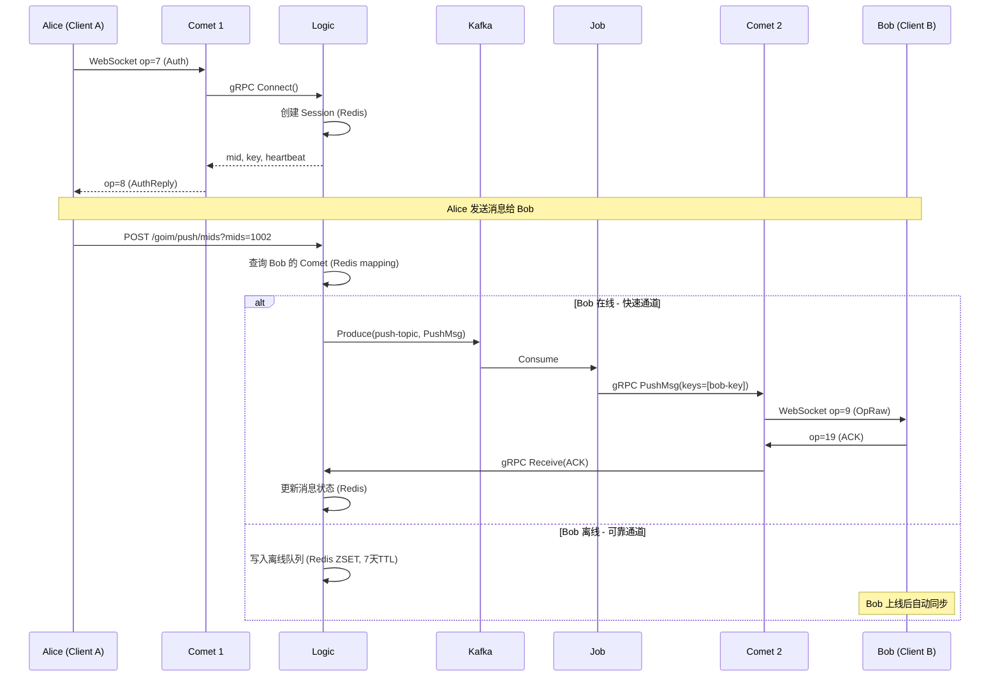
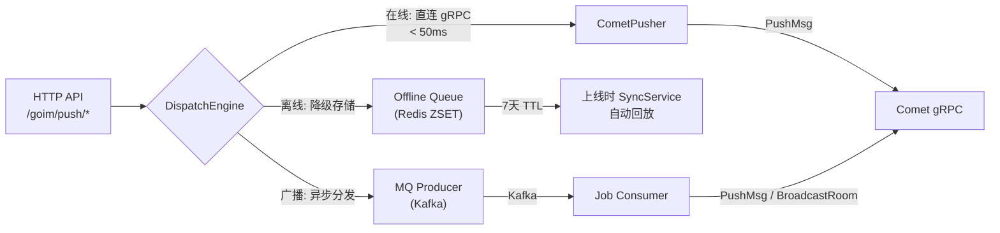
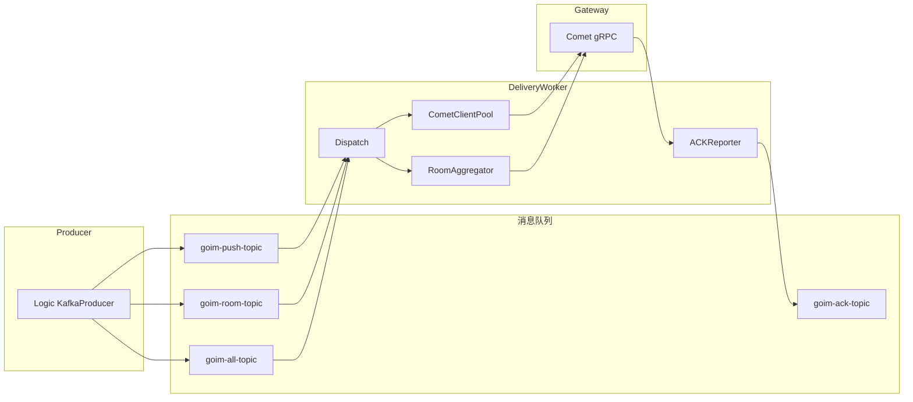

# goim v3.0 - 中文详细文档

[](https://golang.org/)
[](https://github.com/Terry-Mao/goim/actions)

## 项目简介

goim 是一个高性能、可水平扩展的分布式 IM 即时通讯服务端，由 Bilibili 开源。采用三层微服务架构（Comet / Logic / Job），支持百万级在线连接，消息推送延迟 <50ms。

## 核心架构

### 三层微服务

| 服务 | 职责 | 端口 | 依赖 |
|------|------|------|------|
| **Comet** | 连接网关，管理 TCP/WebSocket 长连接 | TCP:3101, WS:3102, gRPC:3109 | Discovery, Logic |
| **Logic** | 业务逻辑，Session 管理，消息路由 | HTTP:3111, gRPC:3119 | Redis, Kafka, Discovery |
| **Job** | Kafka 消费者，消息分发到 Comet | 无 | Kafka, Discovery |

### 系统拓扑



### 消息推送流程



### 双通道推送架构



### v3 架构: Router + Worker



## 核心特性

### 1. 双通道推送
- **快速通道**: 在线用户通过 gRPC 直连 Comet，延迟 <50ms
- **可靠通道**: 离线/失败消息写入 Kafka + Redis 离线队列，上线自动回放

### 2. 消息 ACK + 重试
- 消息全链路状态追踪 (pending -> delivered -> acked/failed)
- 指数退避重试，最多 3 次
- 幂等保证（Redis msg_id 去重）

### 3. 离线消息同步
- Redis ZSET 存储离线消息（score=seq, 7天 TTL）
- 用户上线时 SyncService 自动推送
- 支持 OpSyncReq 手动拉取

### 4. 多设备 Session 管理
- 同设备互踢（device_id 匹配）
- 跨设备共存
- 心跳自动续期（默认 4 分钟）
- Redis 持久化 + 本地缓存

### 5. 二进制协议
```
[packLen:4B] [headerLen:2B=16] [ver:2B] [op:4B] [seq:4B] [body...]
```
- 大端序，固定 16 字节头
- 支持 23 种操作码（Auth, Heartbeat, SendMsg, Raw, Sync, ACK...）

### 6. 区域感知负载均衡
- IP 地理位置 -> 省份 -> 区域映射
- 同区域 Comet 权重加成
- 连接数感知的动态权重调整

### 7. 监控与限流
- Prometheus 指标暴露（/metrics）
- 每连接令牌桶限流
- Snowflake 分布式 ID 生成

## 快速开始

### Docker Compose (推荐)

```bash
# 一键启动所有服务
docker compose up -d

# 查看服务状态
docker compose ps

# 测试 API
curl http://localhost:3111/goim/online/total

# 打开聊天 Demo
# 浏览器访问 http://localhost:8080
```

服务启动顺序: Redis + Kafka + Discovery -> Logic -> Comet + Job

### 手动构建

```bash
# 依赖: Go 1.20+, Redis, Kafka, Discovery
make build

# 启动 Logic
nohup target/logic -conf=target/logic.toml -region=sh -zone=sh001 -deploy.env=dev -weight=10 &

# 启动 Comet
nohup target/comet -conf=target/comet.toml -region=sh -zone=sh001 -deploy.env=dev -weight=10 -addrs=127.0.0.1 &

# 启动 Job
nohup target/job -conf=target/job.toml -region=sh -zone=sh001 -deploy.env=dev &
```

## 配置说明

### Comet 配置

| 配置项 | 说明 | 默认值 |
|--------|------|--------|
| `discovery.nodes` | Discovery 地址 | `["127.0.0.1:7171"]` |
| `tcp.bind` | TCP 端口 | `[":3101"]` |
| `websocket.bind` | WebSocket 端口 | `[":3102"]` |
| `protocol.handshakeTimeout` | 握手超时 | `8s` |
| `protocol.rateLimit` | 每秒限流 | `100.0` |
| `bucket.size` | 连接桶数量 | `32` |

### Logic 配置

| 配置项 | 说明 | 默认值 |
|--------|------|--------|
| `node.heartbeat` | 心跳间隔 | `4m` |
| `kafka.brokers` | Kafka 地址 | `["127.0.0.1:9092"]` |
| `redis.addr` | Redis 地址 | `"127.0.0.1:6379"` |
| `redis.expire` | Session 过期 | `30m` |
| `backoff.maxDelay` | 最大重试延迟 | `300s` |

## HTTP API

| 方法 | 路径 | 说明 | 参数 |
|------|------|------|------|
| POST | `/goim/push/keys` | 按 key 推送 | `operation`, `keys[]` |
| POST | `/goim/push/mids` | 按用户推送 | `operation`, `mids[]` |
| POST | `/goim/push/room` | 房间广播 | `operation`, `type`, `room` |
| POST | `/goim/push/all` | 全局广播 | `operation`, `speed` |
| POST | `/goim/push/offline` | 离线存储 | `mid`, `op`, `seq` |
| GET | `/goim/sync` | 同步离线 | `mid`, `last_seq`, `limit` |
| GET | `/goim/online/total` | 总在线数 | - |
| GET | `/goim/online/room` | 房间在线 | `type`, `rooms[]` |
| GET | `/goim/online/top` | 热门房间 | `type`, `limit` |
| GET | `/goim/nodes/weighted` | 节点列表 | - |
| GET | `/metrics` | Prometheus | - |

## 操作码

| Op | 名称 | 方向 | 说明 |
|----|------|------|------|
| 0 | OpHandshake | C->S | 握手 |
| 2 | OpHeartbeat | C->S | 心跳 |
| 3 | OpHeartbeatReply | S->C | 心跳回复 (含在线数) |
| 4 | OpSendMsg | C->S | 发送消息 |
| 7 | OpAuth | C->S | 认证 |
| 8 | OpAuthReply | S->C | 认证回复 |
| 9 | OpRaw | S->C | 原始消息推送 |
| 12 | OpChangeRoom | C->S | 切换房间 |
| 14 | OpSub | C->S | 订阅操作 |
| 18 | OpSendMsgAck | S->C | 消息发送确认 |
| 19 | OpPushMsgAck | C->S | 推送消息确认 |
| 20 | OpSyncReq | C->S | 同步离线消息请求 |
| 21 | OpSyncReply | S->C | 同步离线消息回复 |

## Redis 数据模型

| Key 模式 | 类型 | 说明 |
|----------|------|------|
| `mid_{uid}` | Hash | 用户 -> 连接 key + 服务器 |
| `key_{key}` | String | 连接 key -> 服务器 |
| `session:{sid}` | Hash | Session 元数据 |
| `user_sessions:{uid}` | Hash | 用户所有 Session |
| `device_session:{uid}:{device}` | String | 设备 Session (互踢) |
| `msg:{msg_id}` | Hash | 消息状态追踪 |
| `offline:{uid}` | ZSET | 离线消息队列 |
| `user_seq:{uid}` | String | 消息序列号 |

## 压测

```bash
# 连接压测
go run benchmarks/conn_bench.go -host=localhost:3101 -count=1000

# 推送压测
go run benchmarks/push_bench.go -logic-host=localhost:3111 -comet-host=localhost:3102

# 一键压测 + HTML 报告
bash benchmarks/run.sh
```

### 历史基准数据

| 指标 | 数值 |
|------|------|
| 在线连接数 | 1,000,000 |
| 测试时长 | 15 分钟 |
| 房间广播频率 | 40/s |
| 消息接收吞吐 | 35,900,000/s |
| CPU 占用 | 2000%~2300% |
| 内存占用 | 14GB |

## License

goim is distributed under the terms of the MIT License.
