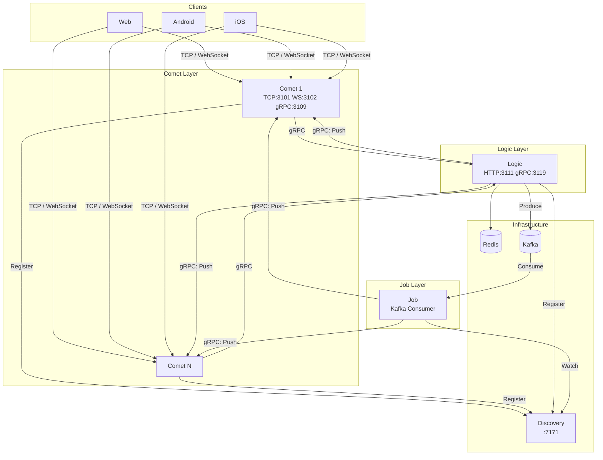
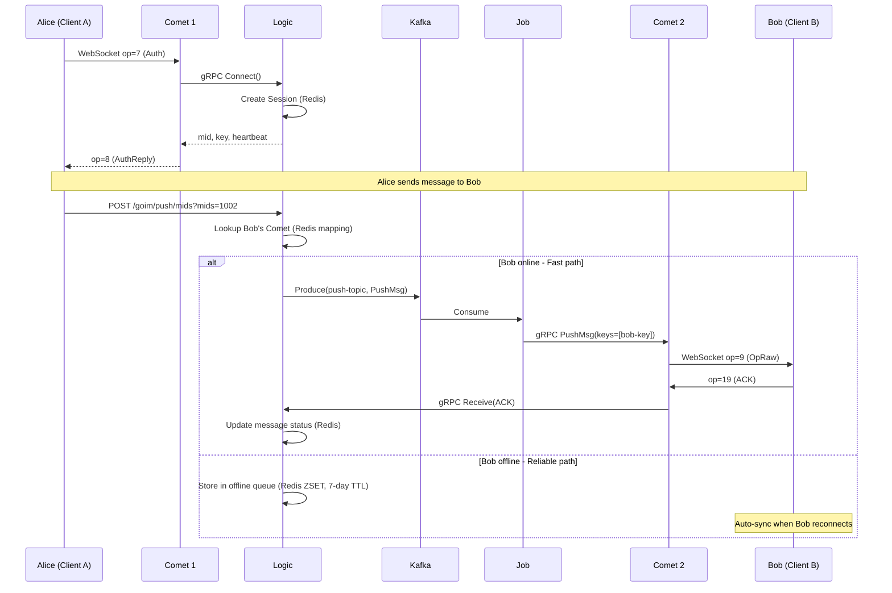
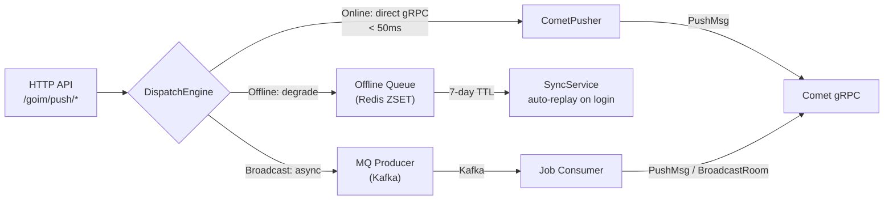
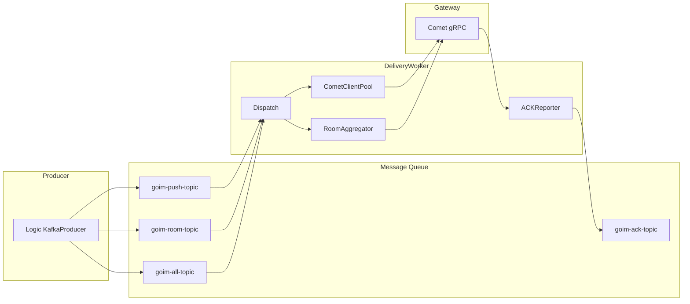

# goim v3.0 - English Documentation

[](https://golang.org/)
[](https://github.com/Terry-Mao/goim/actions)

## Overview

goim is a high-performance, horizontally scalable distributed IM (Instant Messaging) server written in Go. Originally open-sourced by Bilibili, it uses a three-tier microservice architecture (Comet / Logic / Job) supporting millions of concurrent connections with sub-50ms message delivery latency.

## Architecture

### Three-Tier Microservices

| Service | Responsibility | Ports | Dependencies |
|---------|---------------|-------|--------------|
| **Comet** | Connection gateway, manages TCP/WebSocket long connections | TCP:3101, WS:3102, gRPC:3109 | Discovery, Logic |
| **Logic** | Business logic, session management, message routing | HTTP:3111, gRPC:3119 | Redis, Kafka, Discovery |
| **Job** | Kafka consumer, dispatches messages to Comet | None | Kafka, Discovery |

### System Topology



### Message Push Flow



### Dual-Channel Push Architecture



### v3 Architecture: Router + Worker



## Features

- **Dual-Channel Push**: Online users get direct gRPC push (<50ms); offline messages degrade to Kafka + Redis offline queue with auto-replay on reconnect
- **Message ACK + Retry**: Full lifecycle tracking (pending -> delivered -> acked/failed), exponential backoff retry (max 3), idempotent delivery
- **Offline Message Sync**: Redis ZSET storage (7-day TTL), automatic push on user login, manual sync via OpSyncReq
- **Multi-Device Session**: Same-device kick, cross-device coexistence, heartbeat auto-renewal (default 4 min), Redis persistence + local cache
- **Message Router (v3)**: Producer -> Router -> MQ -> DeliveryWorker -> Gateway
- **Dual Protocol**: TCP / WebSocket with binary protocol (16-byte header, big-endian)
- **Prometheus Monitoring**: Connection count, message throughput, latency metrics exposed at `/metrics`
- **Token Bucket Rate Limiting**: Per-connection rate limiting to prevent abuse
- **Snowflake ID**: Distributed unique message ID generation
- **Region-Aware Load Balancing**: IP geolocation -> province -> region, same-region Comet priority

## Quick Start

### Docker Compose (Recommended)

```bash
# Start all services
docker compose up -d

# Check status
docker compose ps

# Test API
curl http://localhost:3111/goim/online/total

# Open chat demo
# Browse http://localhost:8080
```

Startup order: Redis + Kafka + Discovery -> Logic -> Comet + Job

### Manual Build

```bash
# Prerequisites: Go 1.20+, Redis, Kafka, Discovery
make build

# Start Logic
nohup target/logic -conf=target/logic.toml -region=sh -zone=sh001 -deploy.env=dev -weight=10 &

# Start Comet
nohup target/comet -conf=target/comet.toml -region=sh -zone=sh001 -deploy.env=dev -weight=10 -addrs=127.0.0.1 &

# Start Job
nohup target/job -conf=target/job.toml -region=sh -zone=sh001 -deploy.env=dev &
```

## Configuration

### Comet Config

| Key | Description | Default |
|-----|-------------|---------|
| `discovery.nodes` | Discovery addresses | `["127.0.0.1:7171"]` |
| `tcp.bind` | TCP port | `[":3101"]` |
| `websocket.bind` | WebSocket port | `[":3102"]` |
| `protocol.handshakeTimeout` | Handshake timeout | `8s` |
| `protocol.rateLimit` | Rate limit per second | `100.0` |
| `bucket.size` | Connection bucket count | `32` |

### Logic Config

| Key | Description | Default |
|-----|-------------|---------|
| `node.heartbeat` | Heartbeat interval | `4m` |
| `kafka.brokers` | Kafka addresses | `["127.0.0.1:9092"]` |
| `redis.addr` | Redis address | `"127.0.0.1:6379"` |
| `redis.expire` | Session expiry | `30m` |
| `backoff.maxDelay` | Max retry delay | `300s` |

## HTTP API

| Method | Path | Description | Parameters |
|--------|------|-------------|------------|
| POST | `/goim/push/keys` | Push by keys | `operation`, `keys[]` |
| POST | `/goim/push/mids` | Push by user IDs | `operation`, `mids[]` |
| POST | `/goim/push/room` | Room broadcast | `operation`, `type`, `room` |
| POST | `/goim/push/all` | Global broadcast | `operation`, `speed` |
| POST | `/goim/push/offline` | Offline store | `mid`, `op`, `seq` |
| GET | `/goim/sync` | Sync offline | `mid`, `last_seq`, `limit` |
| GET | `/goim/online/total` | Total online | - |
| GET | `/goim/online/room` | Room online | `type`, `rooms[]` |
| GET | `/goim/online/top` | Top rooms | `type`, `limit` |
| GET | `/goim/nodes/weighted` | Node list | - |
| GET | `/metrics` | Prometheus | - |

## Operation Codes

| Op | Name | Direction | Description |
|----|------|-----------|-------------|
| 0 | OpHandshake | C->S | Handshake |
| 2 | OpHeartbeat | C->S | Heartbeat |
| 3 | OpHeartbeatReply | S->C | Heartbeat reply (includes online count) |
| 4 | OpSendMsg | C->S | Send message |
| 7 | OpAuth | C->S | Authentication |
| 8 | OpAuthReply | S->C | Auth reply |
| 9 | OpRaw | S->C | Raw message push |
| 12 | OpChangeRoom | C->S | Change room |
| 14 | OpSub | C->S | Subscribe operations |
| 18 | OpSendMsgAck | S->C | Message send ACK |
| 19 | OpPushMsgAck | C->S | Push received ACK |
| 20 | OpSyncReq | C->S | Sync offline request |
| 21 | OpSyncReply | S->C | Sync offline reply |

## Redis Data Model

| Key Pattern | Type | Description |
|-------------|------|-------------|
| `mid_{uid}` | Hash | User -> connection key + server |
| `key_{key}` | String | Connection key -> server |
| `session:{sid}` | Hash | Session metadata |
| `user_sessions:{uid}` | Hash | All user sessions |
| `device_session:{uid}:{device}` | String | Device session (kick) |
| `msg:{msg_id}` | Hash | Message status tracking |
| `offline:{uid}` | ZSET | Offline message queue |
| `user_seq:{uid}` | String | Message sequence number |

## Benchmarks

```bash
# Connection benchmark
go run benchmarks/conn_bench.go -host=localhost:3101 -count=1000

# Push benchmark
go run benchmarks/push_bench.go -logic-host=localhost:3111 -comet-host=localhost:3102

# Full benchmark + HTML report
bash benchmarks/run.sh
```

### Historical Data

| Metric | Value |
|--------|-------|
| Online connections | 1,000,000 |
| Test duration | 15 min |
| Room broadcast rate | 40/s |
| Message receive throughput | 35,900,000/s |
| CPU usage | 2000%~2300% |
| Memory usage | 14GB |

## License

goim is distributed under the terms of the MIT License.
