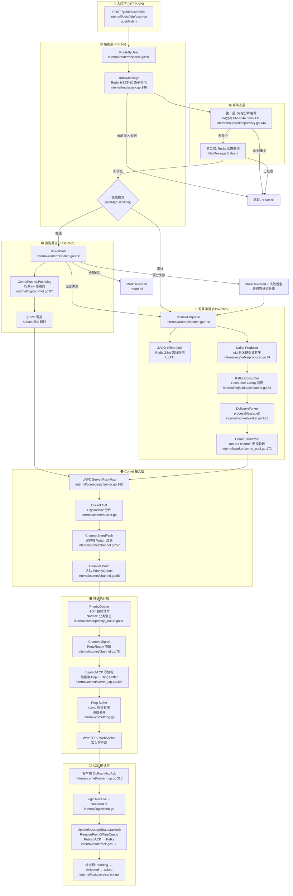
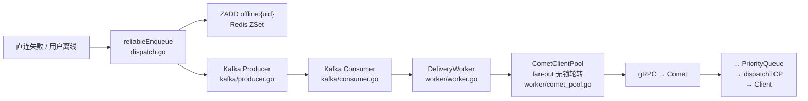
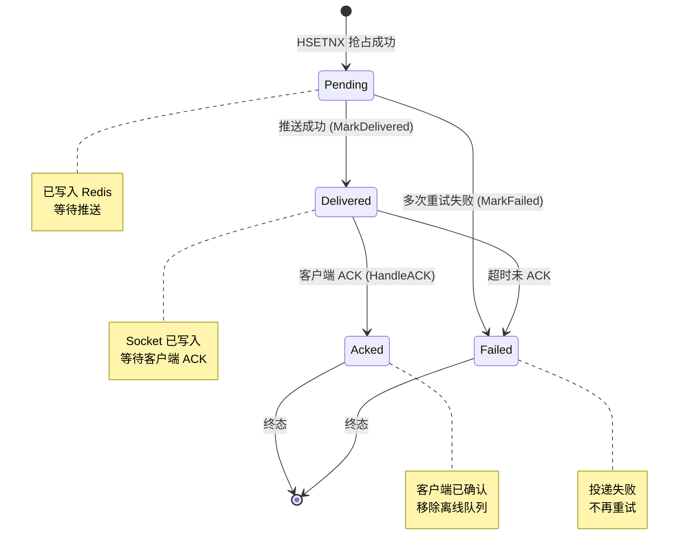
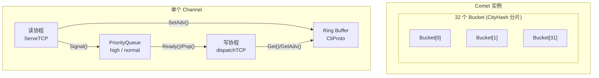

# 消息推送全链路图

## Mermaid 图



## 直连通道（Fast Path）简化版

```mermaid
flowchart LR
    A["HTTP API<br/>push.go"] --> B["RouteByUser<br/>dispatch.go"]
    B --> C["TrackMessage<br/>Redis HSETNX<br/>ack.go"]
    C --> D{"在线?"}
    D -->|是| E["directPush<br/>dispatch.go"]
    E --> F["CometPusher<br/>logic/comet.go"]
    F --> G["gRPC → Comet<br/>grpc/server.go"]
    G --> H["Bucket.Channel<br/>CityHash 分片"]
    H --> I["PriorityQueue<br/>priority_queue.go"]
    I --> J["dispatchTCP<br/>server_tcp.go"]
    J --> K["Ring Buffer<br/>ring.go"]
    K --> L["WriteTCP<br/>→ Client"]
```



## 可靠通道（Slow Path）简化版



## 消息状态机



## 并发模型



---

## D2 图

```d2
direction: right

# ==================== 层级定义 ====================
layers: {
  entry: {
    label: "入口层 (HTTP API)"
    position: top-left
  }
  router: {
    label: "路由层 (Router)"
  }
  idempotent: {
    label: "幂等去重"
  }
  direct: {
    label: "直连通道 (Fast Path)"
  }
  reliable: {
    label: "可靠通道 (Slow Path)"
  }
  comet: {
    label: "Comet 接入层"
  }
  dispatch: {
    label: "推送执行层"
  }
  ack: {
    label: "ACK 确认层"
  }
}

# ==================== 入口层 ====================
entry.api: "POST /goim/push/mids\ninternal/logic/http/push.go\npushMids()" {
  shape: hexagon
  style.fill: "#E3F2FD"
}

# ==================== 路由层 ====================
router.dispatch: "RouteByUser\ninternal/router/dispatch.go:91" {
  shape: diamond
  style.fill: "#FFF9C4"
}

router.track: "TrackMessage\nRedis HSETNX 原子争用\ninternal/router/ack.go:146" {
  shape: diamond
  style.fill: "#FFF9C4"
}

# ==================== 幂等层 ====================
idempotent.memory: "第一层: 内存分片哈希\n64分片 FNV-64a 5min TTL\ninternal/router/idempotency.go" {
  shape: rectangle
  style.fill: "#C8E6C9"
}

idempotent.redis: "第二层: Redis 状态查询\nGetMessageStatus()" {
  shape: rectangle
  style.fill: "#C8E6C9"
}

# ==================== 直连通道 ====================
direct.push: "directPush\ninternal/router/dispatch.go:266" {
  shape: rectangle
  style.fill: "#E1BEE7"
}

direct.comet_pusher: "CometPusher.PushMsg\nOpRaw 预编码\ninternal/logic/comet.go:97" {
  shape: rectangle
  style.fill: "#E1BEE7"
}

direct.grpc_call: "gRPC 调用\n500ms 独立超时" {
  shape: rectangle
  style.fill: "#E1BEE7"
}

# ==================== 可靠通道 ====================
reliable.enqueue: "reliableEnqueue\ninternal/router/dispatch.go:328" {
  shape: rectangle
  style.fill: "#FFCDD2"
}

reliable.zadd: "ZADD offline:{uid}\nRedis ZSet 离线队列\n7天TTL" {
  shape: cylinder
  style.fill: "#FFCDD2"
}

reliable.kafka_producer: "Kafka Producer\nuid 分区键保证有序\ninternal/mq/kafka/producer.go" {
  shape: rectangle
  style.fill: "#FFCDD2"
}

reliable.kafka_consumer: "Kafka Consumer\nConsumer Group 消费\ninternal/mq/kafka/consumer.go" {
  shape: rectangle
  style.fill: "#FFCDD2"
}

reliable.worker: "DeliveryWorker\nprocessMessage()\ninternal/worker/worker.go" {
  shape: rectangle
  style.fill: "#FFCDD2"
}

reliable.pool: "CometClientPool\nfan-out channel 无锁轮转\ninternal/worker/comet_pool.go" {
  shape: rectangle
  style.fill: "#FFCDD2"
}

# ==================== Comet 层 ====================
comet.grpc: "gRPC Server.PushMsg\ninternal/comet/grpc/server.go:185" {
  shape: rectangle
  style.fill: "#FFE0B2"
}

comet.bucket: "Bucket.Get\nCityHash32 分片\ninternal/comet/bucket.go" {
  shape: rectangle
  style.fill: "#FFE0B2"
}

comet.channel: "Channel\nNeedPush + Push\ninternal/comet/channel.go" {
  shape: rectangle
  style.fill: "#FFE0B2"
}

# ==================== 推送执行层 ====================
dispatch.pq: "PriorityQueue\nHigh: 控制信令\nNormal: 业务消息\ninternal/comet/priority_queue.go" {
  shape: queue
  style.fill: "#D7CCC8"
}

dispatch.signal: "Channel.Signal\nProtoReady 唤醒\ninternal/comet/channel.go:78" {
  shape: rectangle
  style.fill: "#D7CCC8"
}

dispatch.tcp: "dispatchTCP 写协程\n阻塞等 Pop → Ring Buffer\ninternal/comet/server_tcp.go:392" {
  shape: rectangle
  style.fill: "#D7CCC8"
}

dispatch.ring: "Ring Buffer\nrp/wp 指针管理\n满则丢弃\ninternal/comet/ring.go" {
  shape: rectangle
  style.fill: "#D7CCC8"
}

dispatch.client: "WriteTCP / WebSocket\n客户端收到消息" {
  shape: hexagon
  style.fill: "#D7CCC8"
}

# ==================== ACK 层 ====================
ack.client_ack: "客户端 OpPushMsgAck\ninternal/comet/server_tcp.go:316" {
  shape: rectangle
  style.fill: "#BDBDBD"
}

ack.handle: "HandleACK\nUpdateMessageStatus → RemoveOffline\n→ PublishACK → Kafka\ninternal/router/ack.go:103" {
  shape: rectangle
  style.fill: "#BDBDBD"
}

ack.state: "状态机\npending → delivered → acked\ninternal/logic/service/ack.go" {
  shape: class
  style.fill: "#BDBDBD"
}

# ==================== 连接关系 ====================

# 主路径
entry.api -> router.dispatch -> router.track

router.track -> idempotent.memory: "检查内存缓存"
idempotent.memory -> idempotent.redis: "未命中"
idempotent.memory -> router.dispatch: "命中→跳过"
idempotent.redis -> router.dispatch: "新消息"

# 在线 → 直连通道
router.track -> direct.push: "用户在线"
direct.push -> direct.comet_pusher
direct.comet_pusher -> direct.grpc_call
direct.grpc_call -> comet.grpc

# 离线/失败 → 可靠通道
router.track -> reliable.enqueue: "离线 / 直连失败"
reliable.enqueue -> reliable.zadd: "写入离线队列"
reliable.enqueue -> reliable.kafka_producer: "投递 Kafka"
reliable.kafka_producer -> reliable.kafka_consumer
reliable.kafka_consumer -> reliable.worker
reliable.worker -> reliable.pool
reliable.pool -> comet.grpc: "gRPC"

# Comet 内部路径
comet.grpc -> comet.bucket
comet.bucket -> comet.channel
comet.channel -> dispatch.pq: "Push"
comet.channel -> dispatch.signal: "Signal"
dispatch.signal -> dispatch.tcp: "唤醒"
dispatch.tcp -> dispatch.ring: "读取"
dispatch.ring -> dispatch.client: "写入"

# ACK 回路
dispatch.client -> ack.client_ack: "客户端 ACK"
ack.client_ack -> ack.handle
ack.handle -> ack.state
```

---

## 核心决策逻辑 D2 图

```d2
direction: right

decision: "RouteByUser\n双通道决策\ninternal/router/dispatch.go:91" {
  shape: diamond
  style.fill: "#FFF9C4"
}

online: "IsOnline?\nsessMgr.IsOnline()" {
  shape: diamond
  style.fill: "#C8E6C9"
}

direct: "直连通道 (Fast Path)\n────────────\ndirectPush()\ngRPC → Comet\n500ms 超时" {
  shape: rectangle
  style.fill: "#E1BEE7"
}

reliable: "可靠通道 (Slow Path)\n────────────\nreliableEnqueue()\nZADD 离线队列 + Kafka\n→ Worker → Comet" {
  shape: rectangle
  style.fill: "#FFCDD2"
}

result_ok: "全部成功\n→ MarkDelivered\n→ return nil" {
  shape: rectangle
  style.fill: "#C8E6C9"
  style.border-radius: 20
}

result_partial: "部分失败\n→ MarkDelivered\n→ 失败设备走可靠通道" {
  shape: rectangle
  style.fill: "#FFF9C4"
  style.border-radius: 20
}

result_fail: "全部失败\n→ 全量走可靠通道" {
  shape: rectangle
  style.fill: "#FFCDD2"
  style.border-radius: 20
}

decision -> online: "HSETNX 抢占成功"
online -> direct: "在线"
online -> reliable: "离线"

direct -> result_ok: "全部成功"
direct -> result_partial: "部分失败"
direct -> result_fail: "全部失败"
result_partial -> reliable: "失败设备补推"
result_fail -> reliable: "全量兜底"
```
